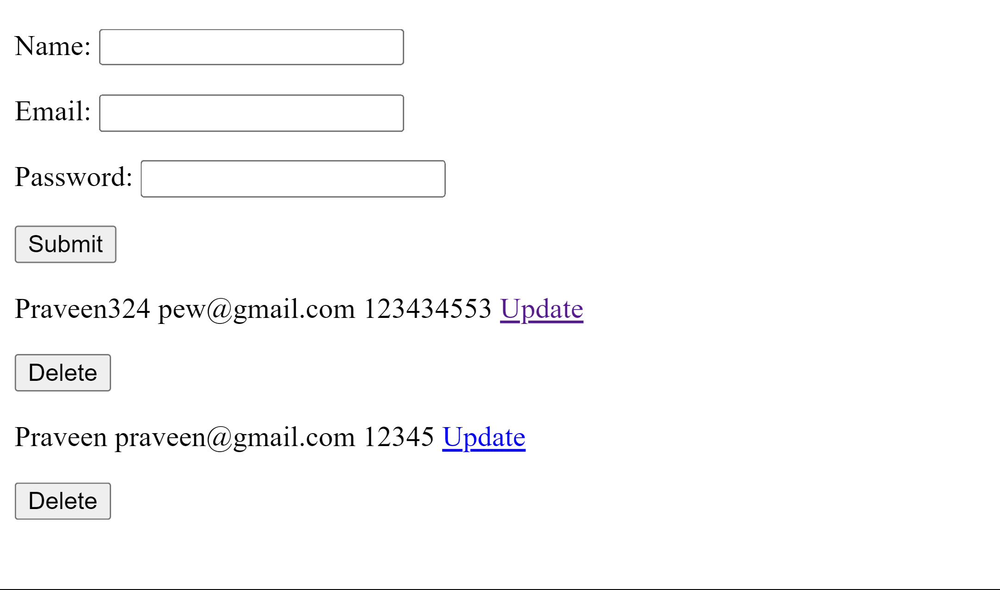

# Simple CRUD APP using Django


<table width="100%"> 
<tr>
<td width="50%">      
&nbsp; 
<br>
<p align="center">
    Form Preview
</p>

</td> 
<td width="50%">
<br>
<p align="center">
    Video Preview
</p>
  
</td>
</table>

## Installation

```bash
git clone https://github.com/dev-mdirfan/simple-crud-django-app.git

cd simple-crud-django-app
```

```bash
pip install -r requirements.txt

python manage.py migrate

python manage.py runserver
```

## Create Your Own

- Terminal
- E:
- cd .\projects\
- `python -m venv .\venv`
- `.\venv\Scripts\activate`
- `pip install django`
- code .
- `.\venv\Scripts\activate`
- `django-admin startproject crud .`
- `python manage.py startapp home`
- In settings.py → `INSTALLED_APPS = “home.apps.HomeConfig”,`
- Create templates inside home app
    - templates → home → index.html
    - templates → base.html

base.html →

```html
<!DOCTYPE html>
<html lang="en">
<head>
    <meta charset="UTF-8">
    <meta name="viewport" content="width=device-width, initial-scale=1.0">
    <title>CRUD</title>
</head>
<body>
    

    
</body>
</html>
```

home → models.py → 

```python
from django.db import models

# Create your models here.
class User(models.Model):
    name = models.CharField(max_length=100)
    email = models.EmailField(max_length=100)
    password = models.CharField(max_length=100)
```

home → admin.py → 

```python
from django.contrib import admin
from .models import User
# Register your models here.

@admin.register(User)

class UserAdmin(admin.ModelAdmin):
    list_display = ['id', 'name', 'email', 'password']
```

home → forms.py → 

```python
from django import forms
from .models import User

class UserRegister(forms.ModelForm):
    class Meta:
        model = User
        fields = ['name', 'email', 'password']
```

home → views.py → 

```python
from django.shortcuts import render, redirect
from .forms import UserRegister
from .models import User
# Create your views here.

def index(request):
    if request.method == 'POST':
        form = UserRegister(request.POST)
        if form.is_valid():
            form.save()
        return redirect('index')
    else:
        form = UserRegister()
    users = User.objects.all()
    context = {
        'form': form,
        'users': users,
    }
    return render(request, 'home/index.html', context)

def update(request, id):
    if request.method == 'POST':
        user = User.objects.get(id=id)
        form = UserRegister(request.POST, instance=user)
        if form.is_valid():
            form.save()
        return redirect('index')
    else:
        user = User.objects.get(id=id)
        form = UserRegister(instance=user)
    context = {
        'form': form,
    }
    return render(request, 'home/update.html', context)

def delete(request, id):
    if request.method == 'POST':
        user = User.objects.get(id=id)
        user.delete()
    return redirect('index')
```

home → [urls.py](http://urls.py) → 

```python
from django.urls import path
from . import views

urlpatterns = [
    path('', views.index, name='index'),
    path('<int:id>/', views.update, name='update'),
    path('delete/<int:id>/', views.delete, name='delete'),
]
```

crud → urls.py

```python
from django.contrib import admin
from django.urls import path, include

urlpatterns = [
    path('admin/', admin.site.urls),
    path('', include('home.urls')),
]
```

index.html →

```html



<form action="" method="POST">
    
    {{ form.as_p }}
    <input type="submit" value="Submit">
</form>


    
        <p>{{ user.name }} {{ user.email }} {{ user.password }}
        <a href="">Update</a>
        <form action="" method="POST">
            
            <input type="submit" value="Delete">
        </form>
        </p>
    

    <p>No users are available.</p>



```

update.html →

```html



<form action="" method="POST">
    
    {{ form.as_p }}
    <input type="submit" value="Update">
</form>

```


